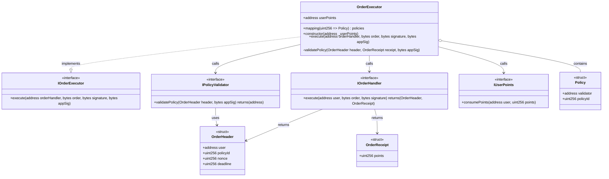

## Prex V2

**Prex V2 is a new version of Prex that is more flexible and powerful.**


### Overview
Prex V2 is a comprehensive smart contract system designed to facilitate secure and efficient order execution, policy validation, and token management on the Ethereum blockchain. It leverages modular architecture and integrates with OpenZeppelin's libraries to ensure robust governance and access control.

### Features
- Order Execution: Execute orders with integrated policy validation to ensure compliance with predefined rules.
- Policy Management: Utilize various policy primitives, including counter and whitelist policies, to enforce execution limits and access control.
- Token Management: Create and manage tokens with the ability to mint up to a maximum supply.
- Lottery System: Manage lotteries with multiple prizes, allowing for creation and drawing of lotteries.
- Governance: Implement governance functionalities for managing proposals and voting.
- Access Control: Manage permissions and roles to ensure only authorized actions are performed.

### Diagram



## Usage

### Build

```shell
$ forge build
```

### Test

```shell
$ forge test
```

### Format

```shell
$ forge fmt
```

### Gas Snapshots

```shell
$ forge snapshot
```

### Anvil

```shell
$ anvil
```

### Deploy


```bash
forge script script/Deploy1OrderExecutor.s.sol --rpc-url $RPC_URL --private-key $PRIVATE_KEY --broadcast --etherscan-api-key $ETHERSCAN_API_KEY --verify
```

```bash
forge script script/Deploy2TokenFactory.s.sol --rpc-url $RPC_URL --private-key $PRIVATE_KEY --broadcast --etherscan-api-key $ETHERSCAN_API_KEY --verify
```

```bash
forge script script/Deploy3DataRegistry.s.sol --rpc-url $RPC_URL --private-key $PRIVATE_KEY --broadcast --etherscan-api-key $ETHERSCAN_API_KEY --verify
```

```bash
forge script script/Deploy4TokenHandler.s.sol --rpc-url $RPC_URL --private-key $PRIVATE_KEY --broadcast --etherscan-api-key $ETHERSCAN_API_KEY --verify
```

```bash
forge script script/Deploy5LoyaltyHandler.s.sol --rpc-url $RPC_URL --private-key $PRIVATE_KEY --broadcast --etherscan-api-key $ETHERSCAN_API_KEY --verify
```

```bash
forge script script/Deploy5PumHandler.s.sol --rpc-url $RPC_URL --private-key $PRIVATE_KEY --broadcast --etherscan-api-key $ETHERSCAN_API_KEY --verify
```

```bash
forge script script/Deploy5TransferHandlers.s.sol --rpc-url $RPC_URL --private-key $PRIVATE_KEY --broadcast --etherscan-api-key $ETHERSCAN_API_KEY --verify
```

```bash
forge script script/Deploy6SwapHandler.s.sol --rpc-url $RPC_URL --private-key $PRIVATE_KEY --broadcast --etherscan-api-key $ETHERSCAN_API_KEY --verify
```

```bash
forge script script/Deploy7DropHandler.s.sol --rpc-url $RPC_URL --private-key $PRIVATE_KEY --broadcast --etherscan-api-key $ETHERSCAN_API_KEY --verify
```

```bash
forge script script/Deploy8LotteryHandler.s.sol --rpc-url $RPC_URL --private-key $PRIVATE_KEY --broadcast --etherscan-api-key $ETHERSCAN_API_KEY --verify
```

```bash
forge script script/Deploy9PaymentHandler.s.sol --rpc-url $RPC_URL --private-key $PRIVATE_KEY --broadcast --etherscan-api-key $ETHERSCAN_API_KEY --verify
```

```bash
forge script script/Deploy13OrderExecutorV2.s.sol --rpc-url $RPC_URL --private-key $PRIVATE_KEY --broadcast --etherscan-api-key $ETHERSCAN_API_KEY --verify
```

```bash
forge script script/Deploy10PumHandler.s.sol --rpc-url $RPC_URL --private-key $PRIVATE_KEY --broadcast --etherscan-api-key $ETHERSCAN_API_KEY --verify
```

```bash
forge script script/Deploy11LoyaltyHandler.s.sol --rpc-url $RPC_URL --private-key $PRIVATE_KEY --broadcast --etherscan-api-key $ETHERSCAN_API_KEY --verify
```

```bash
forge script script/Deploy12SwapHandler.s.sol --rpc-url $RPC_URL --private-key $PRIVATE_KEY --broadcast --etherscan-api-key $ETHERSCAN_API_KEY --verify
```


### Cast

```shell
$ cast <subcommand>
```

### Help

```shell
$ forge --help
$ anvil --help
$ cast --help
```
